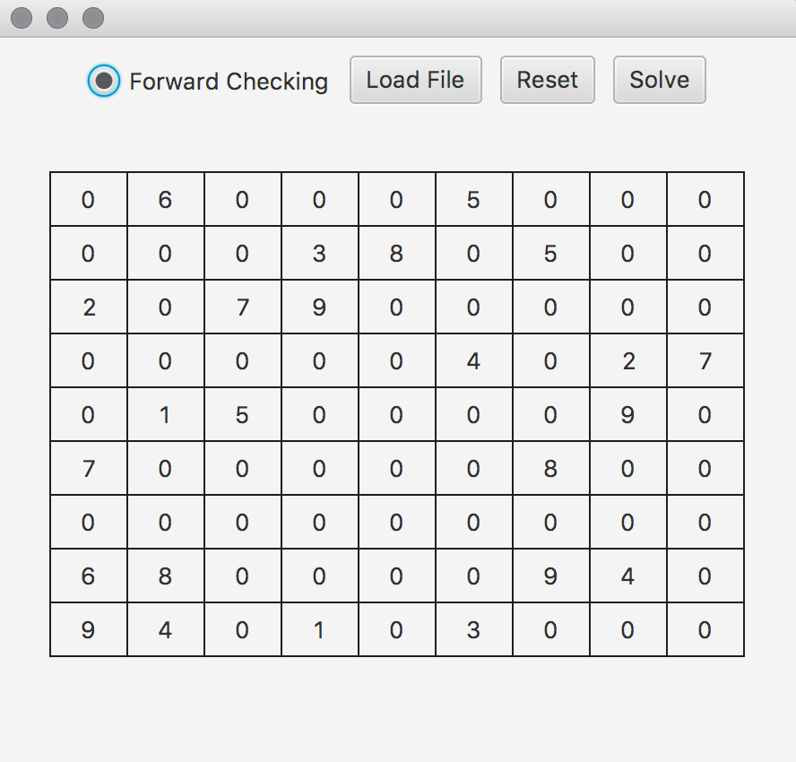
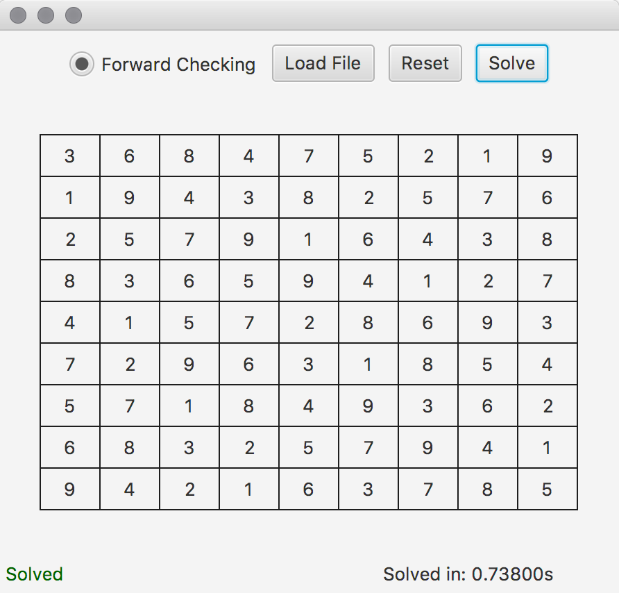
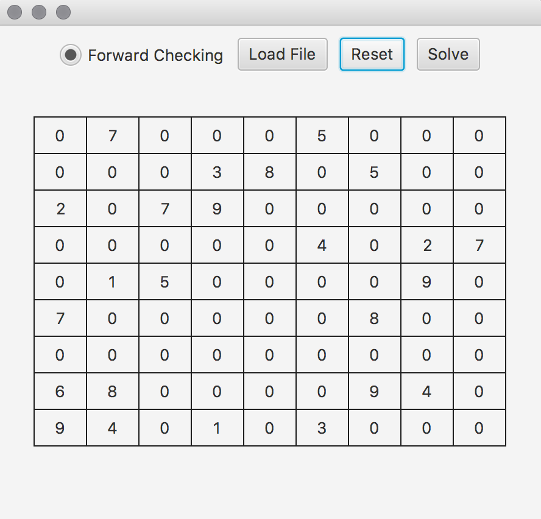
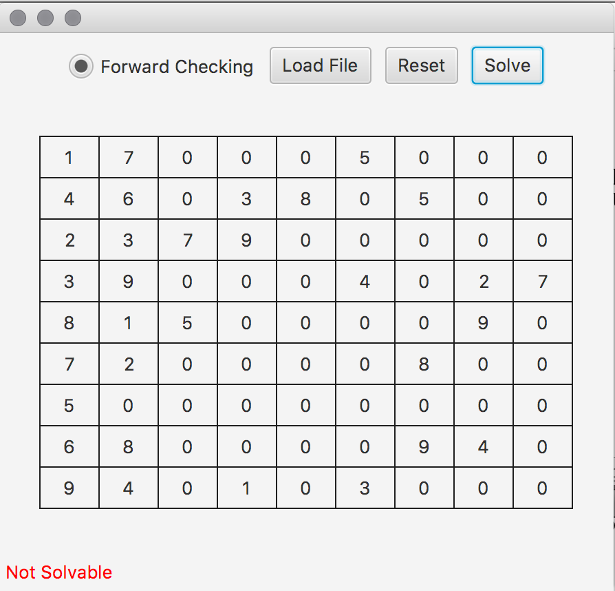

# Sudoku-Solver
> Solving Sudoku Puzzle with CSP algorithm with Forward Checking

## Documentation

  Variable Class :
  
  - For holding data of each variable such as its Value and Domain

  State Class:
  
  - For holding data of each state
  
  ProblemTree Class:
  
  - Search through all available digit (domain of variable) for the next empty spot in the table.
  
  

## Example

### The table that has been shown in the beginning is solvable ###

### Then example below is not solvable because there are two 7 in the first region of table ###

### There is no solution ###

## Author

  - Soheil Changizi ( [@cocolico14](https://github.com/cocolico14) )

## License

This project is licensed under the MIT License - see the [LICENSE](./LICENSE) file for details

